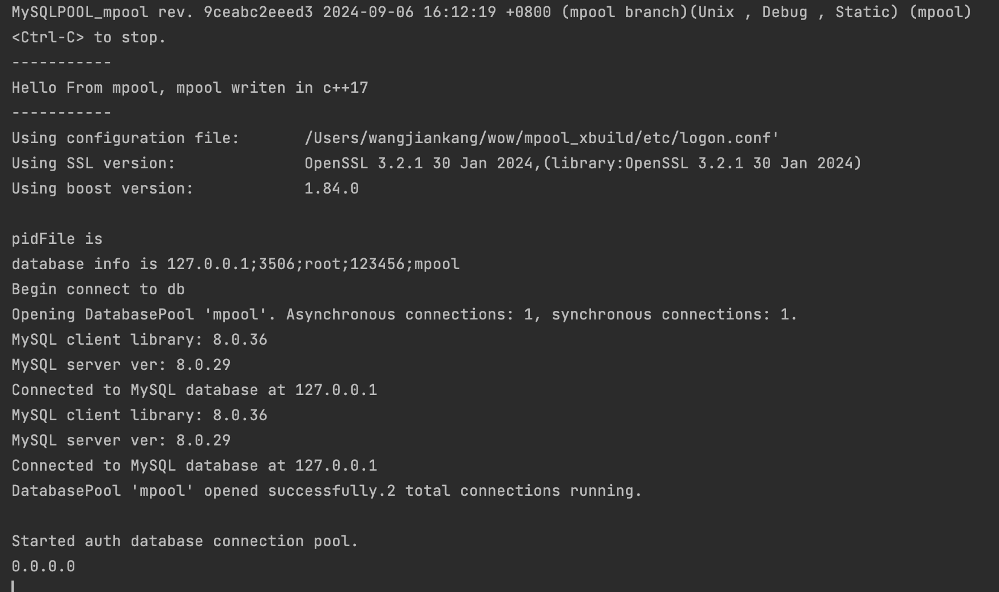

c++实现的MySQL pool SRP6服务端
=

依赖安装

简介:
该c++服务端实现了配置扫描(基于c++无序hash-`unordered_map`)、mysql同步异步连接池并实现了即时预编译sql、boost.asio异步网络功能

`openssl3.0
boost1.74
mysql:8.0`

### mac:
`安装xcode命令行工具
xcode-select --install
sudo xcode-select -s /Applications/Xcode.app/Contents/Developer
`

`brew update
brew install openssl@3 cmake boost bash bash-completion mysql-client@8.0
`

### ubuntu22.04:
`apt-get update && apt-get install git cmake make gcc g++ clang libmysqlclient-dev libssl-dev libboost-all-dev`

### win:
`手动安装boost库及mysql客户端(集成环境一般带有mysql开发库)、openssl3.0`

win下设置BOOST_ROOT环境变量

eg:

BOOST_ROOT

D:/local/boost_1_74_0(boost根目录)

*(解决vs2019无法索引头文件问题:解决方案ALL_BUILD上右键,重新扫描解决方案)*

vs提示错误文件起始位置 notepad++将文件修改位utf8-bom

## 运行日志

### 相关项目

项目  |  名称  |  地址
----  ----  ----
mpool | SRP6服务端 | [mpool](https://github.com/18616378431/mpool)

SRP6ClientForQt6 | SRP6客户端 | [SRP6ClientForQt6](https://github.com/18616378431/SRP6ClientForQt6)

SRP6Register | SRP6注册 ｜  [SRP6Register](https://github.com/18616378431/SRP6Register)

